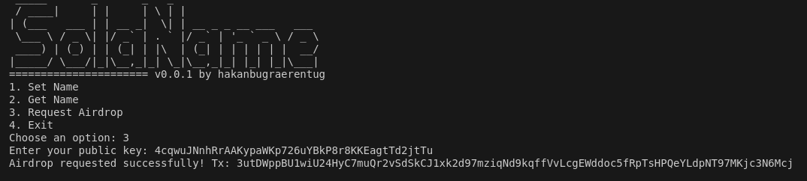

# SolaName

[BlockSprint] Solana Coding Task - 17 Sep 2024

### Before Start

[!WARNING]
Due to limited airdrop request rates, the project published into **devnet** instead of **testnet**.
Please change your configuration to devnet.

```sh
$ solana config set --url devnet
Config File: /home/<>/.config/solana/cli/config.yml
RPC URL: https://api.devnet.solana.com
WebSocket URL: wss://api.devnet.solana.com/ (computed)
Keypair Path: /home/<>/.config/solana/id.json
Commitment: confirmed
```

and check you have enough **SOL**.

```sh
$ solana balance
6.22833528 SOL
```

### Versions

**Note:** Dockerizing in progress!!! Sorry for inconvenience.

```py
rustc 1.81.0 (eeb90cda1 2024-09-04)
solana-cli 1.18.23 (src:aeb3a2e1; feat:4215500110, client:SolanaLabs)
solana cluster-version 2.0.9
avm 0.30.1
anchor-cli 0.27.0
borsh = "0.9" 			   # Borsh serialization library
borsh-derive = "0.10.3"    # Borsh derive macros for structs
```

## Smart Contract

- Utilized by Anchor Framework.
- Located in `solaname/programs/solaname/src/lib.rs`
- Program ID: 8ZUmf4y3KiNbi8sb68BWxJH4nQXTJvSyfevwsVKm8iV2
- Solana Explorer: [Click to see Deployment Transaction](https://explorer.solana.com/tx/52r8gu6T2WNq7tgwKJatHocJsQt17RNGkqXBLDXqhxQAFMdchuMkMzf81GBPzcxjHsGJhgy9wE1eqr5ViaG36DB8?cluster=devnet)
- Do **NOT** store names more than 32 bytes.

```rust
use anchor_lang::prelude::*;
declare_id!("8ZUmf4y3KiNbi8sb68BWxJH4nQXTJvSyfevwsVKm8iV2");
#[program]
mod solaname {
use  super::*;
pub  fn  create_user(
	ctx:  Context<Initialize>,
	first_name:  String,
	last_name:  String,
	) ->  Result<()>
{
	ctx.accounts.new_account.first_name = first_name.clone();
	ctx.accounts.new_account.last_name = last_name.clone();
	msg!("Tx made by Hakan Bugra Erentug for BlockSprint Project!!");
	// Message will show up in the tx logs
	msg!("New Name Saved: {} {}!", first_name, last_name);
	Ok(());
}
}

#[derive(Accounts)]
pub  struct  Initialize<'info> {
// 8 for memory padding
// Do not store the names more than 32 bytes !!!
#[account(init, payer = signer, space = 8 + 32 + 32)]
pub new_account:  Account<'info, UserAccount>,
#[account(mut)]
pub signer:  Signer<'info>,
pub system_program:  Program<'info, System>,
}

#[account]
pub  struct  UserAccount {
pub first_name:  String,
pub last_name:  String,
}
```

## Sample Storage in Program

##### Program Instruction Logs

```sh
 solana logs | grep "8ZUmf4y3KiNbi8sb68BWxJH4nQXTJvSyfevwsVKm8iV2 invoke" -A 7
```

```json
[
  "Program 8ZUmf4y3KiNbi8sb68BWxJH4nQXTJvSyfevwsVKm8iV2 invoke [1]",
  "Program log: Instruction: CreateUser",
  "Program 11111111111111111111111111111111 invoke [2]",
  "Program 11111111111111111111111111111111 success",
  "Program log: Tx made by Hakan Bugra Erentug for BlockSprint Project!!",
  "Program log: New Name Saved: Thomas Wagner!",
  "Program 8ZUmf4y3KiNbi8sb68BWxJH4nQXTJvSyfevwsVKm8iV2 consumed 7347 of 200000 compute units",
  "Program 8ZUmf4y3KiNbi8sb68BWxJH4nQXTJvSyfevwsVKm8iV2 success"
]
```

Check `create_user` interactions in solana explorer.

- [Hakan Erentug](https://explorer.solana.com/tx/ak3PB1Dwz1Z3yg8ksU2mdYMgtG5jJARvkRD2chLPaoMPEQwsYjf1RNhCmaWdCgCzYfUBzKosE8gct6j9UBL1j9U?cluster=devnet)
- [Thomas Wagner](https://explorer.solana.com/tx/4dDoT1HELWQwU2XxGW8KGfRhDSk7bGVAguniQTPjCZBQAaWyVMUpTct8qNKEvCLXvUkKZuG8FpHfjMvWXiRUtLv?cluster=devnet)
- [Felix Hoops](https://explorer.solana.com/tx/4m3aBsCLcDtfovNzVoafHfVQNmnm1FPFaXoij39MSGCcQUhfGWfJfRBSz8p2bW3rBxEjFDhXMWU9ZwxF3DPi9deC?cluster=devnet)

#### Fetch All

```json
[
  {
    "publicKey": "B4DgYfUAqd2DkTdBqGSZo7rGB4dDdLum6QgctRS4fLNQ",
    "account": { "firstName": "Felix", "lastName": "Hoops" }
  },
  {
    "publicKey": "4cqwuJNnhRrAAKypaWKp726uYBkP8r8KKEagtTd2jtTu",
    "account": { "firstName": "Hakan", "lastName": "Erentug" }
  },
  {
    "publicKey": "5tJQrCP3n9xTrtJDn7pAPXFp47ceodc2rPNhdf2K7QyB",
    "account": { "firstName": "Thomas", "lastName": "Wagner" }
  }
]
```

## Console Application

### To test start with Airdropping 1 SOL to your pubkey.


